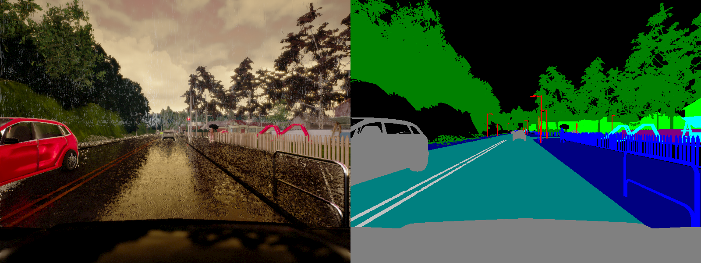
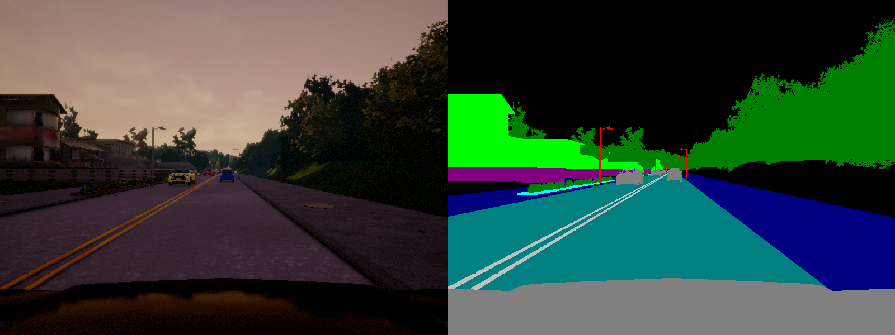
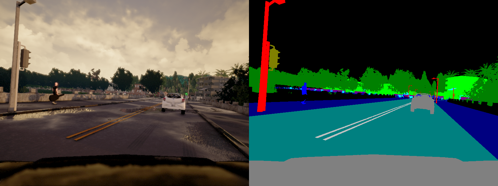
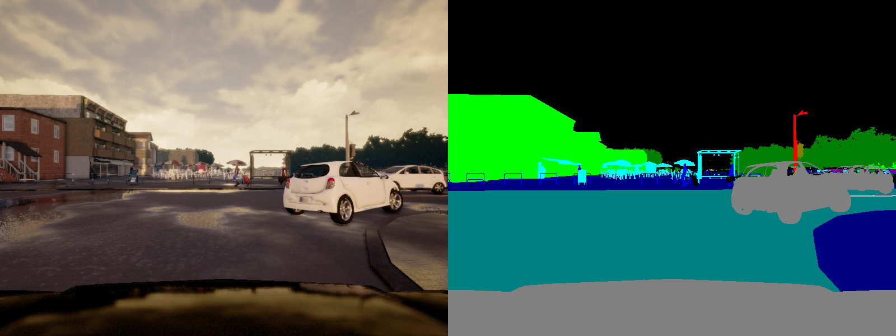
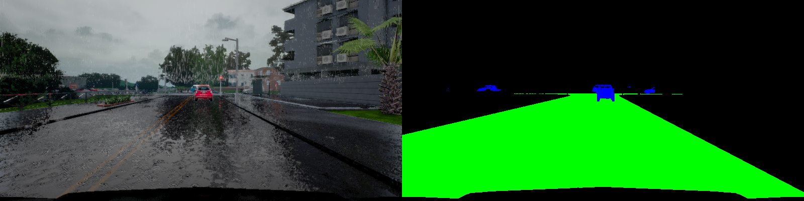
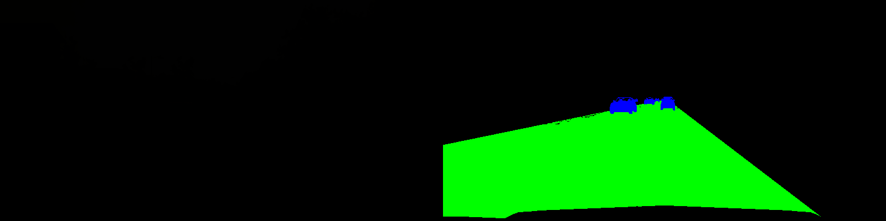
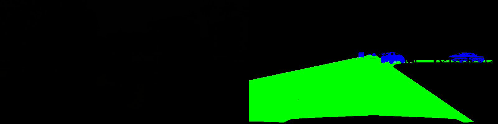
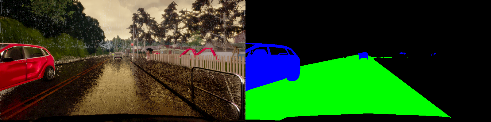

# **Lyft Challenge - Identifying Vehicles and Drivable Road in CARLA (In Progress...)**

[//]: # (Image References)

[image1]: ./examples/Snapshot_8.png "Example 1"
[image2]: ./examples/Snapshot_9.png "Example 2"
[image3]: ./examples/Snapshot_6.png "Example 3"
[image4]: ./examples/Snapshot_7.png "Example 4"
[image6]: ./examples/placeholder_small.png "Normal Image"
[image7]: ./examples/placeholder_small.png "Flipped Image"

Overview
---
I have recently participated in Lyft-Udacity Self-Driving Car challenge to identify drivable road and cars from the dashboard
camera on pixel-pixel bases. The challenge lasted for one month and there were 155 participants. I finished 26th in the challenge with overal F-score = 90.14 and FPS=10.64 This repository contains description of data, pre-processing and architecures 
I used for this challenge.

To train neural network acrhitecure using data from CARLA simulator. 
[CARLA](http://carla.readthedocs.io/en/latest/) is an open-source simulator for autonomous driving developed by Intel Labs 
and the Computer Vision Center. The simulator includes a virtual world with realistic looking roads, buildings and trees, 
but also dynamic objects like cars and pedestrians. It allows to select 13 various weather conditions which include dry, sunny
rainy and wet roads. Simulation of shadows and surface reflections cretes realistic scenes. 
CARLA allows to produce labels for semantic segmenatation, depth segmenatation and LiDAR data. Following images are some
examples from simulator with labels. 

  
  

In this project, I used transfer learning to extract features with ResNet50, and applied Upsamples+Convolution layers 
to classify pixesl to three classes (Road, Vehicle and Others). This repository contains detailed explanation of the model
and predictions. 

Files used to train, run and predict segmentation are explained below.   
* main_segment_pipeline.py (main script for trianing, inference and plotting)
* helper_to_model.py (script used to create a model)
* helper_to_train.py (script used to train model and define learning rate, algorithm, batch size etc.)
* helper_prepare_data.py (script to preprocess data, create labels and generate batchs)
* model.pb (a frozen Keras model)
* test_video.mp4 (hidden video that determined ranking)

This README file describes how to output the video in the "Details About Files In This Directory" section.

Pre-Processing 
---
* Trimming data: I trimmed images to exclude hood of the car and sky. Original labels contain 13 classes, for this challenge the goal is to identify road and vehicles on pixel-by-pixel bases. Following images demonstrate several examples after pre-processing. 
* Normalization: For each color channel I used standard normalization to scale intensity by 255 and subtract 0.5

  
  

Data 
---
I have collected around 5k images including images shared by particiapants and ones I generated using CARLA. 
To augment images I used random flipping, changing of contrast, random shifting (left 50, down 50), 
rotation (-15,+15 degrees) and zoom. Data suffered class imbalance only ~5% and ~25% pixels contained vehicles and roads 
from the scene. Moreover, images are sequnetial and using small batches could result fast convergence with high bias.  
To address this issues, I have tried to shuffle data as much as possible, which would break asymmetry in sequences. 
To address imbalance I have collected more data using simulator with increased number of vehicles. I have also tried created
custom loss function to avoid "fake" low-loss. 

Model Description
---

Training 
---
For training step I used 10 epochs with 4-6 batchs (depending on the avaibility of recources). 
* Loss function: Initially, I trianed model using only categorical-cross_entropy. The loss converged pretty fast, however, individual segmentation of vehicles was poor. Adding tverskiy-loss has improved segmentation of both vehicles and roads. 
Tverky-loss is similar to dice index with additional parameters to weight FPs or FNs. I gave more weight on FNs to avoid 
missing vehicles. 
* Optimizer: I used RMSProp optimizer with initial learning_rate 0.0001, with exponetial moving average factor of 0.95. 
I added callback to reduce learning rate after by a factor 0.1 after 3 epochs, if no improvement observed in validation loss. 
* Saving Model: Using keras.callbacks library I saved intermediate weitghs which produced least validation loss. 


Inference
---


### Dependencies
This lab requires:

* [CarND Term1 Starter Kit](https://github.com/udacity/CarND-Term1-Starter-Kit)

The lab enviroment can be created with CarND Term1 Starter Kit. Click [here](https://github.com/udacity/CarND-Term1-Starter-Kit/blob/master/README.md) for the details.

The following resources can be found in this github repository:
* drive.py
* video.py
* writeup_template.md

The simulator can be downloaded from the classroom. In the classroom, we have also provided sample data that you can optionally use to help train your model.

## Details About Files In This Directory

### `drive.py`

Usage of `drive.py` requires you have saved the trained model as an h5 file, i.e. `model.h5`. See the [Keras documentation](https://keras.io/getting-started/faq/#how-can-i-save-a-keras-model) for how to create this file using the following command:
```sh
model.save(filepath)
```

Once the model has been saved, it can be used with drive.py using this command:

```sh
python drive.py model.h5
```

The above command will load the trained model and use the model to make predictions on individual images in real-time and send the predicted angle back to the server via a websocket connection.

Note: There is known local system's setting issue with replacing "," with "." when using drive.py. When this happens it can make predicted steering values clipped to max/min values. If this occurs, a known fix for this is to add "export LANG=en_US.utf8" to the bashrc file.

#### Saving a video of the autonomous agent

```sh
python drive.py model.h5 run1
```

The fourth argument, `run1`, is the directory in which to save the images seen by the agent. If the directory already exists, it'll be overwritten.

```sh
ls run1

[2017-01-09 16:10:23 EST]  12KiB 2017_01_09_21_10_23_424.jpg
[2017-01-09 16:10:23 EST]  12KiB 2017_01_09_21_10_23_451.jpg
[2017-01-09 16:10:23 EST]  12KiB 2017_01_09_21_10_23_477.jpg
[2017-01-09 16:10:23 EST]  12KiB 2017_01_09_21_10_23_528.jpg
[2017-01-09 16:10:23 EST]  12KiB 2017_01_09_21_10_23_573.jpg
[2017-01-09 16:10:23 EST]  12KiB 2017_01_09_21_10_23_618.jpg
[2017-01-09 16:10:23 EST]  12KiB 2017_01_09_21_10_23_697.jpg
[2017-01-09 16:10:23 EST]  12KiB 2017_01_09_21_10_23_723.jpg
[2017-01-09 16:10:23 EST]  12KiB 2017_01_09_21_10_23_749.jpg
[2017-01-09 16:10:23 EST]  12KiB 2017_01_09_21_10_23_817.jpg
...
```

The image file name is a timestamp of when the image was seen. This information is used by `video.py` to create a chronological video of the agent driving.

### `video.py`

```sh
python video.py run1
```

Creates a video based on images found in the `run1` directory. The name of the video will be the name of the directory followed by `'.mp4'`, so, in this case the video will be `run1.mp4`.

Optionally, one can specify the FPS (frames per second) of the video:

```sh
python video.py run1 --fps 48
```

Will run the video at 48 FPS. The default FPS is 60.

#### Why create a video

1. It's been noted the simulator might perform differently based on the hardware. So if your model drives succesfully on your machine it might not on another machine (your reviewer). Saving a video is a solid backup in case this happens.
2. You could slightly alter the code in `drive.py` and/or `video.py` to create a video of what your model sees after the image is processed (may be helpful for debugging).

### Tips
- Please keep in mind that training images are loaded in BGR colorspace using cv2 while drive.py load images in RGB to predict the steering angles.

## How to write a README
A well written README file can enhance your project and portfolio.  Develop your abilities to create professional README files by completing [this free course](https://www.udacity.com/course/writing-readmes--ud777).

