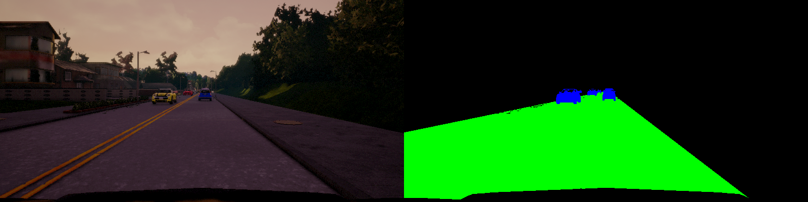

# **Lyft Challenge - Identifying Vehicles and Drivable Road in CARLA**

[//]: # (Image References)

[image1]: ./examples/Snapshot_8.png "Example 1"
[image2]: ./examples/Snapshot_9.png "Example 2"
[image3]: ./examples/Snapshot_6.png "Example 3"
[image4]: ./examples/Snapshot_7.png "Example 4"
[image6]: ./examples/placeholder_small.png "Normal Image"
[image7]: ./examples/placeholder_small.png "Flipped Image"

Overview
---
I have recently participated in Lyft-Udacity Self-Driving Car challenge to identify drivable road and cars from the dashboard
camera on pixel-pixel bases. The challenge lasted for one month and there were 155 participants. I finished *26th* in the 
challenge with overal **F-score = 90.14 and FPS=10.64** This repository contains description of data, pre-processing and 
architecures I used for this challenge.

To train neural network acrhitecure using data from CARLA simulator. 
[CARLA](http://carla.readthedocs.io/en/latest/) is an open-source simulator for autonomous driving developed by Intel Labs 
and the Computer Vision Center. The simulator includes a virtual world with realistic looking roads, buildings and trees, 
but also dynamic objects like cars and pedestrians. It allows to select 13 various weather conditions which include dry, sunny
rainy and wet roads. Simulation of shadows and surface reflections cretes realistic scenes. 
CARLA allows to produce labels for semantic segmenatation, depth segmenatation and LiDAR data. Following images are some
examples from simulator with labels. 

  
  

In this project, I used transfer learning to extract features with ResNet50, and applied Upsample+Convolution layers 
to classify pixels to three classes (Road, Vehicle and Others). This repository contains detailed explanation of the model
and predictions. 

Files used to train, run and predict segmentation are explained below.   
* main_segment_pipeline.py (main script for trianing, inference and plotting)
* helper_to_model.py (script used to create a model)
* helper_to_train.py (script used to train model and define learning rate, algorithm, batch size etc.)
* helper_prepare_data.py (script to preprocess data, create labels and generate batchs)
* model.pb (a frozen Keras model)
* test_video.mp4 (hidden video that determined ranking)

This README file describes how to output the video in the "Details About Files In This Directory" section.

Pre-Processing 
---
* Trimming data: I trimmed images to exclude hood of the car and sky. Original labels contain 13 classes, for this challenge 
the goal is to identify road and vehicles on pixel-by-pixel bases. Following images demonstrate several examples after 
pre-processing. Pre-processed image dimentions are (400,800,3). 
* Normalization: For each color channel I used standard normalization, each pixel intensity is scale intensity by 255 
and shifted 0.5

  
  

Data 
---
I have collected around 5k images including images shared by particiapants and the ones I generated using CARLA. 
Additionally, I augmented data set by randomly flipping, changing the contrast, randomly shifting (left 50, down 50), 
rotating (-15,+15 degrees) and zooming. Images are highly imbalanced, only ~5% and ~30% pixels contained vehicles and roads 
from the scene. Moreover, images are sequnetial and using small batches could result fast convergence with high bias.  
To address this issues, I shuffled dataset, which would break asymmetry in sequences. 
To address imbalance I have collected more data using simulator with increased number of vehicles. I have also tried created
custom loss function to avoid "fake" high-score. 

Model Description
---
To extract features I used ResNet50 pre-trained model. ResNet50 contains 50 stack of 1x1+3x3+1x1 Convolution layers with 
additional skip connections. I keep track of each downsampling layer before bottle-neck layer. Then I upsample bottle-neck
layer and concatenate it with corresponding downsampled layer from base model (helper_to_models.py). 
Each upsampling step consists of 3x3 Conv/BN/LeakyReLU/Concat(downSample, upSample)/BN/LeakyReLU/Conv/BN/LeakyReLU layers. 
Training on (400,800) input image was slow and acheived only several FPS. Challenge required that minimum FPS 
is greater than 10 FPS. To increase speed, I resized images to (256,256) dimensions. For the last two 
upsampling shapes I used (100,200), (200,400) and (400,800) output shapes. This helped to restore original resolution of the 
image. For resizing I wrote custom keras Layer using TensorFlow biliniar upsampling method. 

| Layer Name    |Output Shape |Number of Parameters| Connected to |Trainable|
| ------------- |:-----------:|:------------------:|:------------:|:-------:|
| Input_1       | (400,800,3) | 0                  |None          | False   |
| Resize        | (256,256,3) | 0                  |Input_1       | False   |
| ResNet_downsample1 | (128,128,64) | ~9.7K         |Input_1       | False   |
| ResNet_downsample2 | (63,63,256) | ~200K         |ResNet_downsample1 | False   |
| ResNet_downsample3 | (32,32,512) | ~1.2M         |ResNet_downsample2 | False   |
| ResNet_downsample4 | (16,16,1024) | ~7.1M        |ResNet_downsample3 | False   |
| ResNet_downsample5 | (8,8,2048) | ~15M           |ResNet_downsample4 | False   |
| BottleNeck1 | (8,8,1024) | ~2.1M           |ResNet_downsample5 | True   |
| BottleNeck2 | (8,8,512) | ~500K           |BottleNeck1 | True   |
| Upsampling1 | (16,16,256) | ~4.7M           |[BottleNeck1,ResNet_downsample4] | True   |
| Upsampling2 | (32,32,128) | ~1.2M           |[Upsampling1,ResNet_downsample3] | True   |
| Upsampling3 | (63,63,64) | ~300K           |[Upsampling2,ResNet_downsample2] | True   |
| Upsampling4 | (128,128,32) | ~37K           |[Upsampling3,ResNet_downsample1] | True   |
| Upsampling5 | (200,400,24) | ~18K           |[Upsampling4,Resize] | True   |
| Upsampling6 | (400,800,12) | ~5.6K           |[Upsampling5,Input_1] | True   |
| SoftMax | (400,800,3) | 39           |Upsampling6 | True   |


|  |Total Parameters | 
|--|-----------------|
|Non-trainable | ~32M|
|Trainable | ~9M | 

Training 
---
I trained net architecture for 10 epochs with 4-6 batchs (depending on the avaibility of recources). 
I used custom built desktop with GeForce GTX 1060 6GB Nvidia graphics card to train the model. 
Based on the batch size and input image size, 10 epochs lasted from 1.5 hr to 2.5 hr.    
* Loss function: Initially, I trianed model using only categorical-cross_entropy. The loss converged pretty fast, however, individual segmentation of vehicles was poor. Adding tverskiy-loss has improved segmentation of both vehicles and roads. 
Tverky-loss is similar to dice index with additional parameters to weight FPs or FNs. I gave more weight on FNs to avoid 
missing vehicles. 
* Optimizer: I used RMSProp optimizer with initial learning_rate 0.0001, with exponetial moving average factor of 0.95. 
I added callback to reduce learning rate after by a factor 0.1 after 3 epochs, if no improvement observed in validation loss. 
* Saving Model: Using keras.callbacks library I saved intermediate weitghs which produced least validation loss. 


Inference
---
For faster inference I convert keras model tensorflow .pb file. It runs 10 FPS. 
Following links are predictions of the model. 


[](https://www.youtube.com/embed/lwoHJpcJ2zo)
[](https://www.youtube.com/embed/_KxLwL1LaRI)


Things I would do
---
Later after the contest I learning participants trained on large amount of data (~40k images). I would definetly use more data.
I did not try other pretrained models such as MobileNet and VGG16, which would be good to compare. I realized improving 
resolution of images increases overall score with cost to FPS. It would be nice to fine-tune input shape of image.  

## Details About Files In This Directory

### `main_segment_pipeline.py`

You can run `main_segment_pipeline.py` with three arguments 'train|test|plot'. 
* Train will train new model if model doesn't exist otherwise it will train existing model. 
* Test outputs prediction for validation test data. For debuggin purposes. 
* Plot prints labels and images after pre-processing. 

You can change the model parameters in `helper_to_model.py` file. Beore training, it is possible to adjust 
training algorihm hyper-parameters in `helper_to_train.py`. Once you are ready to train run following command 

```sh
python3 main_segment_pipeline.py "train"
```
New model name will be saved in './chekcpoint/' directory with a model name provided in `config.py` file. 
You experiment with different image input shapes, batchSize and other filters in  `config.py` file. 
Once the model has been trained, it can be used to display prediction frames using this command:

```sh
python3 main_segment_pipeline.py "test"
```

The above command will load the trained model and use the model to make predictions on individual images in real-time. 
Using arrow keys user can display frames individually. 

#### Saving a video of the prediction video

```sh
python3 predict_video.py "your_input_video.mp4"
```

This command will output original video frame ovelayed with vehicle/road predictions. 


